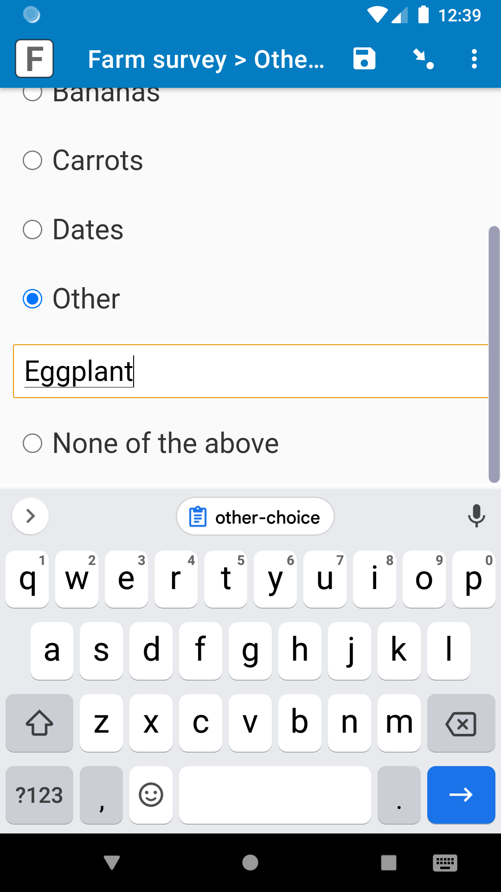
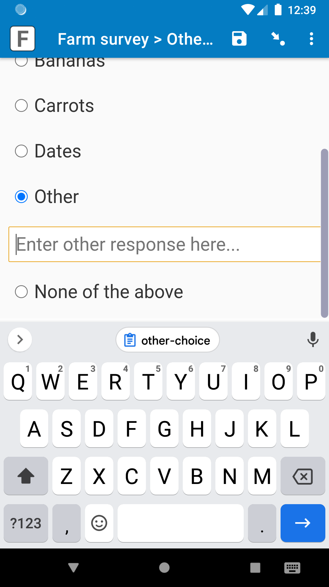
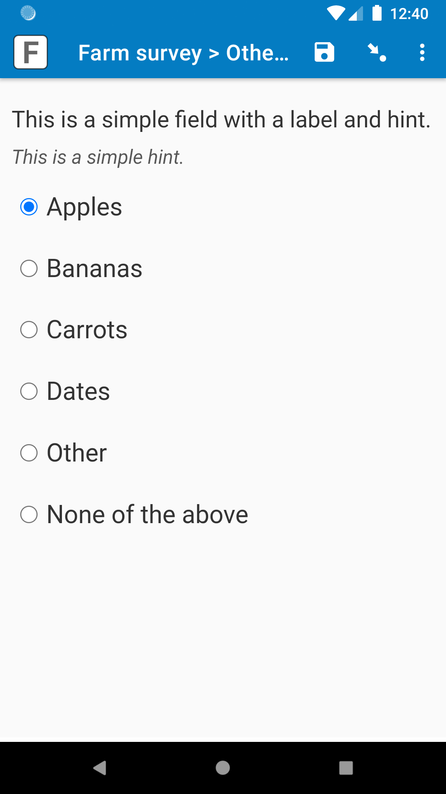

# Specify other

|||
|:---:|:---:|
|Waiting for text|Main choice selected|

## Description

With this field plug-in, when a specific choice is selected, a text box appears where the enumerator can enter a text response. This is helpful for fields that have an "Other" choice, so the enumerator can enter the "Other" response right on the same page. This works with both [*select_one*](https://docs.surveycto.com/02-designing-forms/01-core-concepts/03h.field-types-select-one.html) and [*select_multiple*](https://docs.surveycto.com/02-designing-forms/01-core-concepts/03i.field-types-select-multiple.html) fields.

To learn more about "other" responses in SurveyCTO, check out our support article on [creating an open response field after a multiple choice question that asks users to "specify other"](https://support.surveycto.com/hc/en-us/articles/219910787).

*This plug-in is currently under beta. If you you find a problem with the field plug-in, please email support@surveycto.com, or submit an issue to this GitHub repo.*

*An older version of this field plug-in was called "other-input", but there is no difference between the old version and the new version other than the name. The sample form has been updated with the new name.*

## Features

* Able to enter a text response when a specific choice is selected (often called the "Other" choice).
* Customize which choice will make the text box appear.
* Text box appears right below "Other" choice when selected.
* All of the capabilities of the [select_one-select_multiple](https://github.com/surveycto/select_one-select_multiple/blob/master/README.md) field plug-in.

### Requirements

Android: Android 7 or up

iOS and web browsers: Because web browsers and iOS devices are kept more up-to-date with the latest features, nearly all web browsers and iOS devices should support the field plug-in, but test it on your collection device beforehand to be sure.

## Data format

The field value will be the selected choice.

The data in the text box will be stored in the field plug-in metadata. To retrieve that text box data, use this expression:

    item-at('|', plug-in-metadata(${basic_hint-so}), 1)

You can add a [*calculate* field](https://docs.surveycto.com/02-designing-forms/01-core-concepts/03zb.field-types-calculate.html) with that *calculation*. Check out our documentation on [using expressions](https://docs.surveycto.com/02-designing-forms/01-core-concepts/09.expressions.html) to learn about the functions used.

The item-at() function is used because other data is stored in the metadata for internal purposes. You can use the above expression to retrieve just the text box data.

The metadata will store the data in the text box, even if the text box is hidden (such as if "Other" was previously selected). If you'd like, you can give that *calculate* field a *[relevance](https://docs.surveycto.com/02-designing-forms/01-core-concepts/08.relevance.html)* expression so that it is only relevant if the "Other" choice was selected. For example, if the "Other" choice has a choice *value* of "-1", you can give the *calculate* field that retreives the metadata this *relevance* expression:

    selected(${crop_most}, '-1')

## How to use

### Getting started

*To use this plug-in as is:*

1. Download the [sample form](https://github.com/surveycto/specify-other/raw/master/extras/sample-form/Specify%20other%20sample%20form.xlsx) from this repo, as well as the [media files ZIP file](https://github.com/surveycto/specify-other/raw/master/extras/sample-form/media.zip). You can use the sample form as-is, or adjust the parameters to change the behavior ([see below](#parameters)).
1. Download the [specify-other.fieldplugin.zip](https://github.com/surveycto/specify-other/raw/master/specify-other.fieldplugin.zip) file from this repo, and attach it to the sample form on your SurveyCTO server.
1. Upload the sample form to your server, with the media files ZIP file and the field plug-in attached.

Note: For simplicity, in the sample form, the field plug-in metadata is only retrieved for the first field. However, if multiple fields use this field plug-in, you can absolutely add multiple *calculate* fields that use the plug-in-metadata() function, so you can retrieve the "Other" data for each of those fields.

### Parameters

|Name|Description|
|:--|:--|
|`other` (optional)|The *value* of the choice where if it is selected, then the text box will appear. For example, if this parameter has a value of `'-1'`, then when the choice with a *value* of "-1" is selected, the text box will appear. If this parameter has no value, then the last choice in the choice list will be used.|
|`required` (optional)|Normally, if the text box appears, then the enumerator cannot move forward until they enter data into that text box. If this parameter has a value of `0`, then they can leave that text box blank, since it is not required; it will also say "(optional)" in the placeholder text.|

### Special circumstance: Leaving the text box blank

If you plan on giving the field with this field plug-in a [*required*](https://docs.surveycto.com/02-designing-forms/01-core-concepts/05.other-columns.html) value (different than the `required` parameter) of "no" or blank, check out our documentation on [leaving the text box blank](extras/other-docs/text-box-blank.md). If the field will always be *required*, then there is nothing to worry about.

## Default SurveyCTO feature support

| Feature / Property | Support |
| --- | --- |
| Supported field type(s) | `select_one`, `select_multiple`|
| Default values | Yes |
| Custom constraint message | Yes |
| Custom required message | Yes |
| Read only | Yes |
| media:image | Yes |
| media:audio | Yes |
| media:video | Yes |
| `quick` appearance | Yes (`select_one` only) |
| `minimal` appearance | Yes (`select_one` only) |
| `compact` appearance | No |
| `compact-#` appearance | No |
| `quickcompact` appearance | No |
| `quickcompact-#` appearance | No |
| `likert` appearance | Yes (`select_one` only) |
| `likert-min` appearance | Yes* (`select_one` only) |
| `likert-mid` appearance | No |
| `label` appearance | Yes |
| `list-nolabel` appearance | Yes |

*Note: this plug-in works well for the likert-min appearance when the field label is short, and does not contain an image, audio, or video. This is currently a known limitation.

## More resources

* **Developer documentation**  
Instructions and resources for developing your own field plug-ins.  
[https://github.com/surveycto/Field-plug-in-resources](https://github.com/surveycto/Field-plug-in-resources)

* **User documentation**  
How to get started using field plug-ins in your SurveyCTO form.  
[https://docs.surveycto.com/02-designing-forms/03-advanced-topics/06.using-field-plug-ins.html](https://docs.surveycto.com/02-designing-forms/03-advanced-topics/06.using-field-plug-ins.html)
