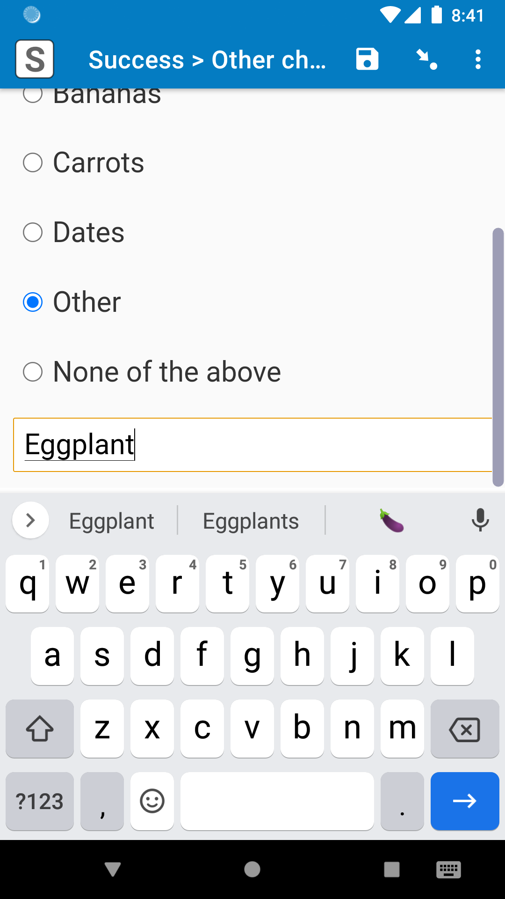
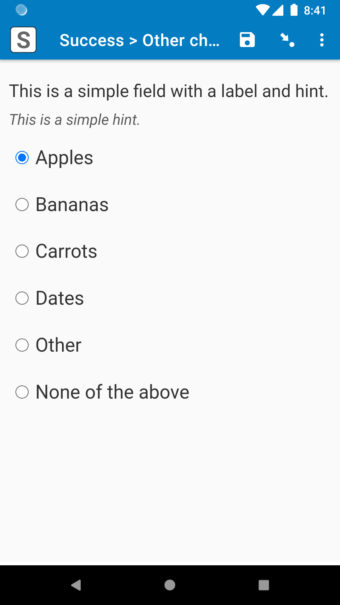

# Other choice

|||
|:--:||:---:|
|Waiting for text||Main choice selected|

## Description

With this field plug-in, you can set it so when a specific choice is selected, a text box appears where the enumerator can enter a text response. This is helpful for fields that have an "Other" choice, so the enumerator can enter the "Other" response right on the same page.

## Features

* Able to enter a text response when a specific choice is selected.
* Choose which choice will make the text box appear.
* All of the capabilities of the [select_one-select_multiple](https://github.com/surveycto/select_one-select_multiple/blob/master/README.md) field plug-in.

## Data format

The field value will be the selected choice.

The data in the text box will be stored in the field plug-in metadata. To retrieve that data, use the [plug-in-metadata() function](https://docs.surveycto.com/02-designing-forms/01-core-concepts/09.expressions.html#plug-in-metadata). For example, if the field with this field plug-in is called "crop_most", then to retrieve the data in the text box, add a *calculate* field with this *calculation*:

    plug-in-metadata(${crop_most})

If you'd like, you can give that *calculate* field a *[relevance](https://docs.surveycto.com/02-designing-forms/01-core-concepts/08.relevance.html)* expression so that it is only relevant if the "Other" choice was selected. For example, if the "Other" choice has a choice *value* of "-1", you can give the *calculate* field that retreives the metadata this *relevance* expression:

    selected(${crop_most}, '-1')

## How to use

### Getting started

*To use this plug-in as is:*

1. Download the [sample form]() from this repo, as well as the [media files ZIP file](). You can use the sample form as-is, or adjust the parameters to change the behavior (see below).
1. Download the other-choice.fieldplugin.zip file from this repo, and attach it to the sample form on your SurveyCTO server.
1. Upload the sample form to your server, with the media files ZIP file and the field plug-in attached.

Note: For simplicity, in the sample form, the field plug-in metadata is only retrieved for the first field. However, if you have multiple fields using this field plug-in, you can absolutely use the plug-in-metadata() function on each of those fields.

### Parameter

|Name|Description|
|:--|:--|
|`other` (optional)|The *value* of the choice where if it is selected, then the text box will appear. For example, if this parameter has a value of "-1", then when the choice with a *value* of "-1" is selected, the text box will appear. If this parameter has no value, then the last choice in the choice list will be used.

## Default SurveyCTO feature support

| Feature / Property | Support |
| --- | --- |
| Supported field type(s) | `select_one`, `select_multiple`|
| Default values | Yes |
| Custom constraint message | Yes |
| Custom required message | Yes |
| Read only | Yes |
| media:image | Yes |
| media:audio | Yes |
| media:video | Yes |
| `quick` appearance | Yes (`select_one` only) |
| `minimal` appearance | Yes (`select_one` only) |
| `compact` appearance | No |
| `compact-#` appearance | No |
| `quickcompact` appearance | No |
| `quickcompact-#` appearance | No |
| `likert` appearance | Yes (`select_one` only) |
| `likert-min` appearance | Yes* (`select_one` only) |
| `likert-mid` appearance | No |
| `label` appearance | Yes |
| `list-nolabel` appearance | Yes |

*Note: this plug-in works well for the likert-min appearance when the field label is short, and does not contain an image, audio, or video. This is currently a known limitation.

## More resources

* **Sample form**  
Click [here](https://github.com/surveycto/other-choice/blob/master/extras/test-form/Test%20form%20and%20media.zip?raw=true) to download a ZIP file with the test files. Decompress the test file, and there will be a form definition spreadsheet and another ZIP file. Upload that form to your server with that file "media.zip" attached (you do not have to decompress "media.zip", but you can if you'd like).

* **Developer documentation**  
Instructions and resources for developing your own field plug-ins.  
[https://github.com/surveycto/Field-plug-in-resources](https://github.com/surveycto/Field-plug-in-resources)

* **User documentation**  
How to get started using field plug-ins in your SurveyCTO form.  
[https://docs.surveycto.com/02-designing-forms/03-advanced-topics/06.using-field-plug-ins.html](https://docs.surveycto.com/02-designing-forms/03-advanced-topics/06.using-field-plug-ins.html)
